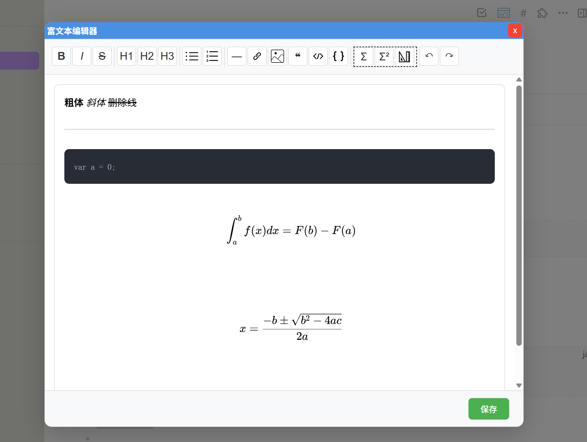
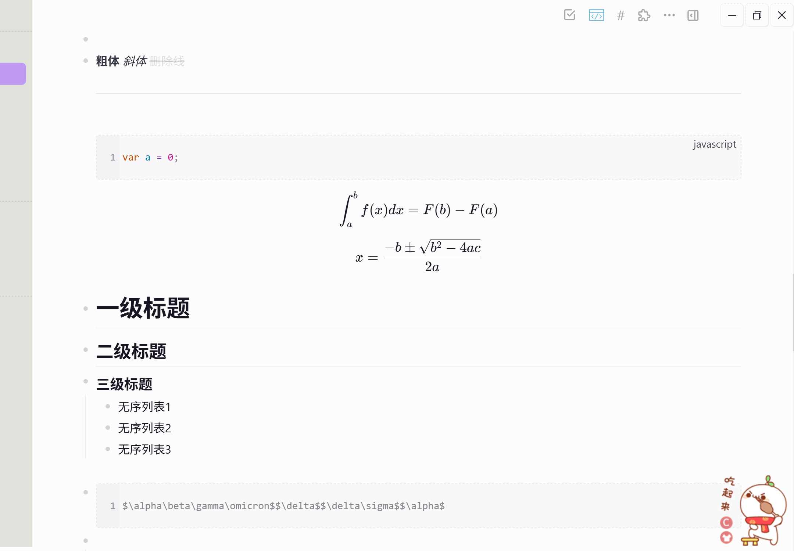

# 富文本编辑器插件

一个可视化编辑器插件，让你无需编写Markdown语法即可编辑Logseq内容。  
第一版代码主要由deepseek给出，并由jarray调整及修改BUG到可发行。  

## 功能特点

- 🎨 可视化富文本编辑
- 🔧 完整的格式化工具栏
- 📋 实时Markdown预览
- 🖼️ 支持图片和链接插入
- ⌨️ 支持快捷键操作
- 💾 支持撤销和重做
- 🍄 支持Latex公式

## Latex公式功能\

1. 行内公式、块级公式两种方式
2. 快捷公式库，预置常用公式模板
3. 数学符号面板，分类显示常用符号
4. 实时预览，语法错误提示
5. 复制为LaTeX代码
6. 支持的LaTeX功能
    - 基本数学：分数、根号、上下标
    - 希腊字母：α、β、γ、π 等
    - 运算符：∑、∫、∂、∇ 等
    - 关系符号：=、≠、≤、≥、∈、⊂ 等
    - 箭头：→、⇐、↦、↔ 等
    - 括号：()、[]、{}、⟨⟩ 等
    - 函数：sin、cos、log、exp 等
    - 装饰符号：矢量、横线、尖帽等
    - 矩阵：pmatrix、bmatrix 等
    - 对齐环境：align、gather 等

## 效果图

编辑画面

logseq效果


## 致谢

1. 编辑器组件使用了tiptap库
2. 数学公式使用了katex库
3. 基础代码使用[deepseek](https://chat.deepseek.com)生成，后续调试修改了两周。

## 使用方法

1. 点击要可视化编辑的block所在行
2. 在Logseq工具栏中点击RichTextEditor图标
3. 使用编辑器中工具栏按钮编辑文本
4. 点击保存按钮同步回block
5. 或按ESC或点击关闭按钮取消

## TODOList

1. 支持TODO
2. 一级、二级、三级标题不能与其他文本混合在一个block，需要限制；
3. 无序列表，需要每个item在单独一个block中
4. 有序列表，需要使用logseq.order-list-type:: number特殊节点属性处理
5. 代码块的编码语言使用下拉菜单代替自己输入
6. 代码编辑时不同语言的样式

## 开发

```bash
# 安装依赖
npm install

# 开发调试模式
npm run dev

# 构建插件
npm run build

# 执行单元测试
npm run test
```

## 调试

1. 从github下载插件代码
2. 在vscode中使用`npm run dev`生成dist目录
3. 在Logseq中启用开发者模式
4. 点击"加载未发布的插件"
5. 选择代码根目录（非dist目录）
6. 开发者模式打开后，在logseq主界面使用`ctrl+shift+i`热键可以打开浏览器控制台

## 版本历史

### v1.0.1 2026/02

- 增加支持下划线
- 😊增加支持emoji
- 增加支持字体颜色

### v0.1.2 2026/01

- 完成第一版本，上架插件市场。  
- 🎨 可视化富文本编辑
- 🔧 完整的格式化工具栏
- 📋 实时Markdown预览
- 🖼️ 支持图片和链接插入
- ⌨️ 支持快捷键操作
- 💾 支持撤销和重做
- 🍄 支持Latex公式
